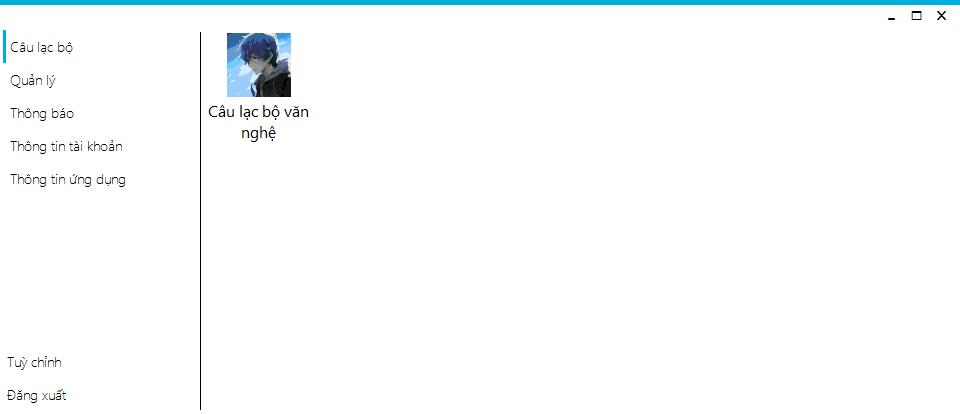
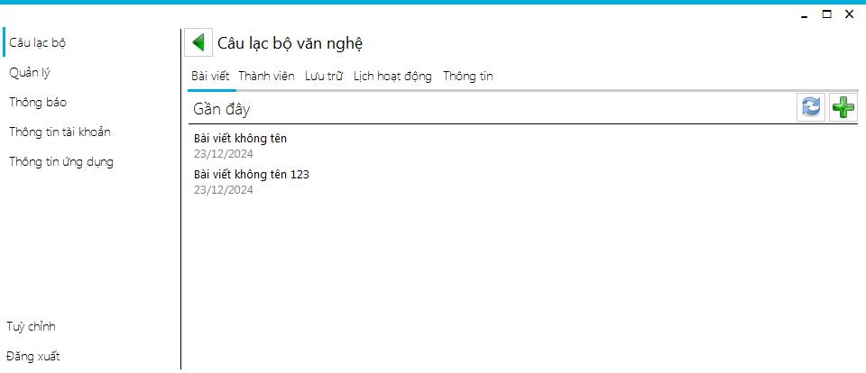
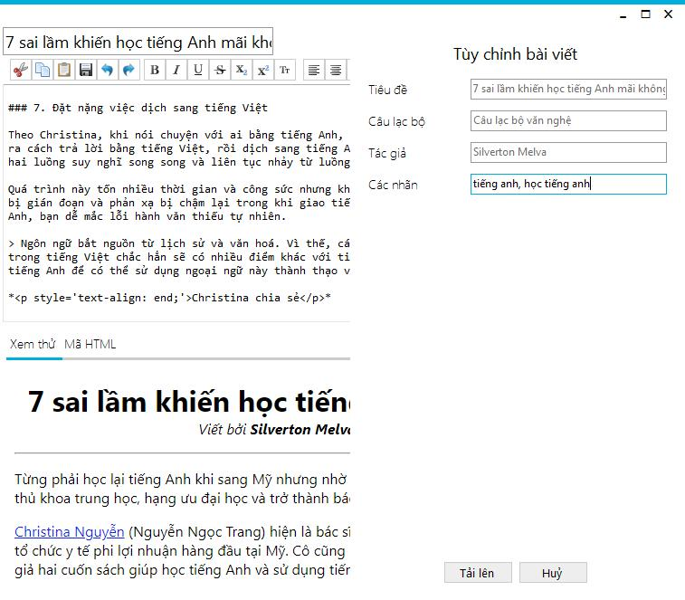
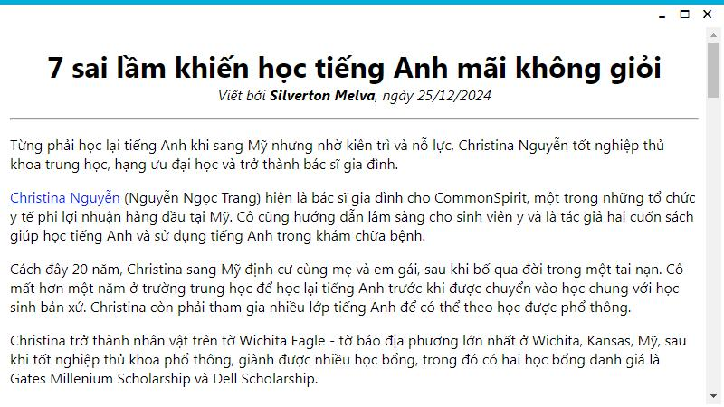
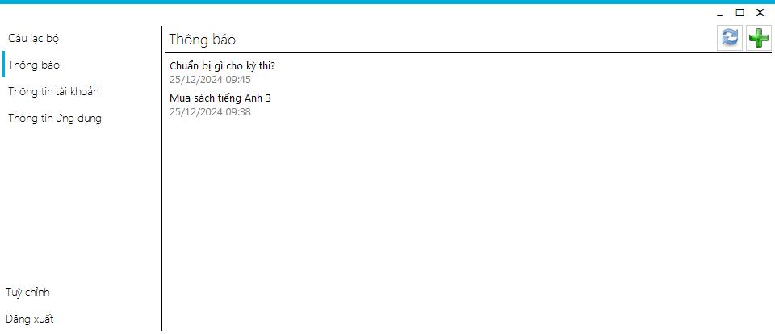
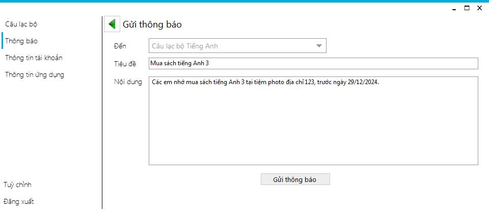
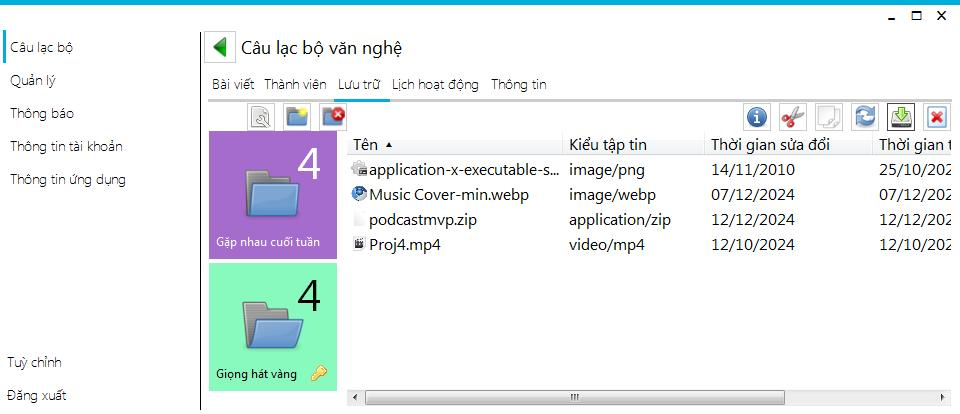
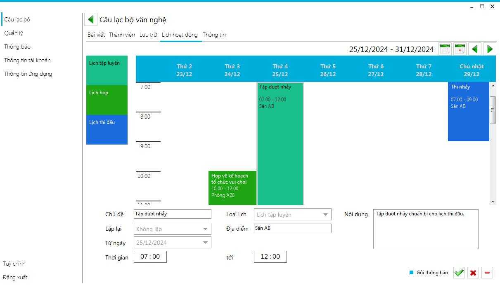

# Phần mềm quản lý câu lạc bộ sinh viên
Phần mềm quản lý Câu lạc bộ Sinh viên giúp tự động hóa quy trình quản lý, giảm bớt khối lượng công việc thủ công và nâng cao hiệu quả hoạt động của câu lạc bộ. Giao diện thân thiện và dễ sử dụng, giúp ban quản lý dễ dàng truy cập và quản lý thông tin mọi lúc, mọi nơi.

Với phần mềm Quản lý Câu lạc bộ Sinh viên, việc tổ chức và điều hành các hoạt động trở nên đơn giản và hiệu quả hơn, góp phần tạo nên một môi trường học tập và hoạt động ngoại khóa phong phú, hấp dẫn cho sinh viên.

## Các tính năng nổi bật
Phần mềm có các tính năng hữu ích sau:
- Bài viết
- Thông báo
- Lưu trữ
- Lịch

### Bài viết
Với tính năng này, trưởng/phó nhóm có thể soạn các bài viết và đăng tải lên câu lạc bộ, và các thành viên hiện diện trong câu lạc bộ có thể xem các bài viết đó.

### Thông báo
Chức năng này giúp các thành viên trong câu lạc bộ nắm bắt và theo dõi tình hình về câu lạc bộ.

  
  

### Lưu trữ
Phần mềm cũng cung cấp hệ thống lưu trữ, cho phép thành viên truy cập vào kho lưu trữ các tập tin được gửi lên.

### Lịch hoạt động
Tính năng này giúp thành viên xem lịch hoạt động diễn ra trong tuần trong câu lạc bộ.

## Cách cài đặt
Chọn các file có tên bắt đầu bằng `QuanLyCLBSetup.zip` (`QuanLyCLBSetup.zip.001`, `QuanLyCLBSetup.zip.002`, ...) rồi click chuột phải chọn `Extract Here` đợi giải nén, sau đó nhấn vào thư mục `QuanLyCLBSetup` > `Release` và chạy file `setup.exe` để tiến hành quy trình cài đặt.

## Thư viện ảnh
Xem [screenshots](./screenshots).

## Thông tin kỹ thuật
- Tên phần mềm: Phần mềm quản lý Câu lạc bộ Sinh viên
- Ngôn ngữ lập trình: C#
- UI Framework: WinForms
- Thư viện sử dụng: ReaLTaiizor, Markdig, CefSharp, LibVLCSharp, VideoLAN.LibVLC.Windows

## Yêu cầu hệ thống
- Hệ điều hành: Windows 7+
- Dung lượng tối thiểu: 434MB
- Bộ nhớ tối thiểu: 500MB
- NET Framework: 4.6.1+
